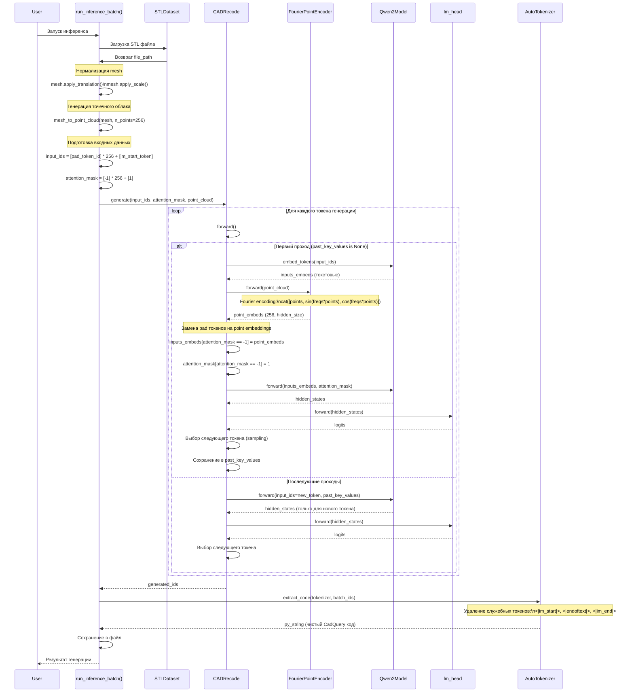
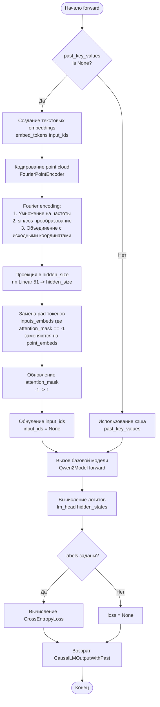
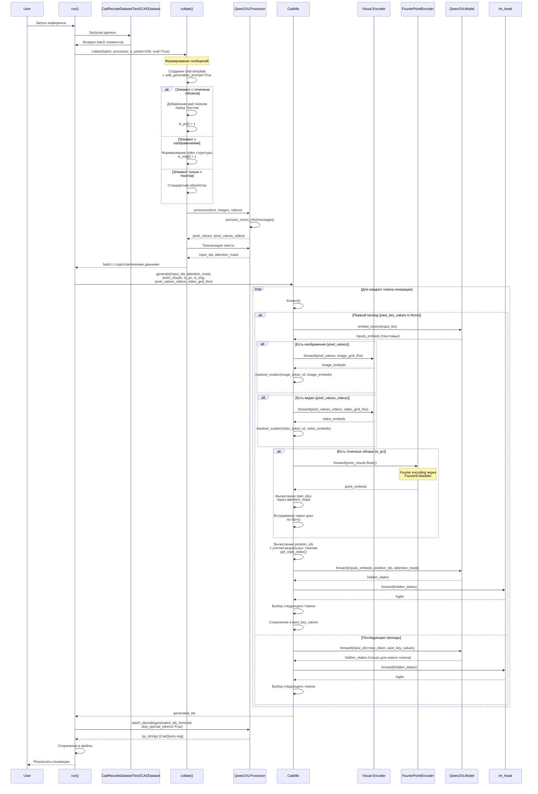
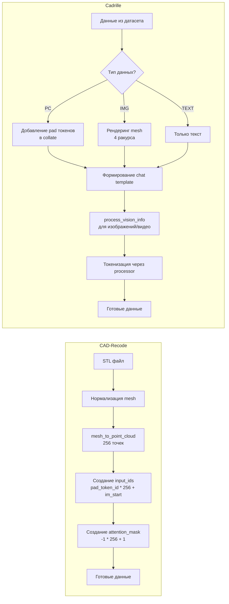
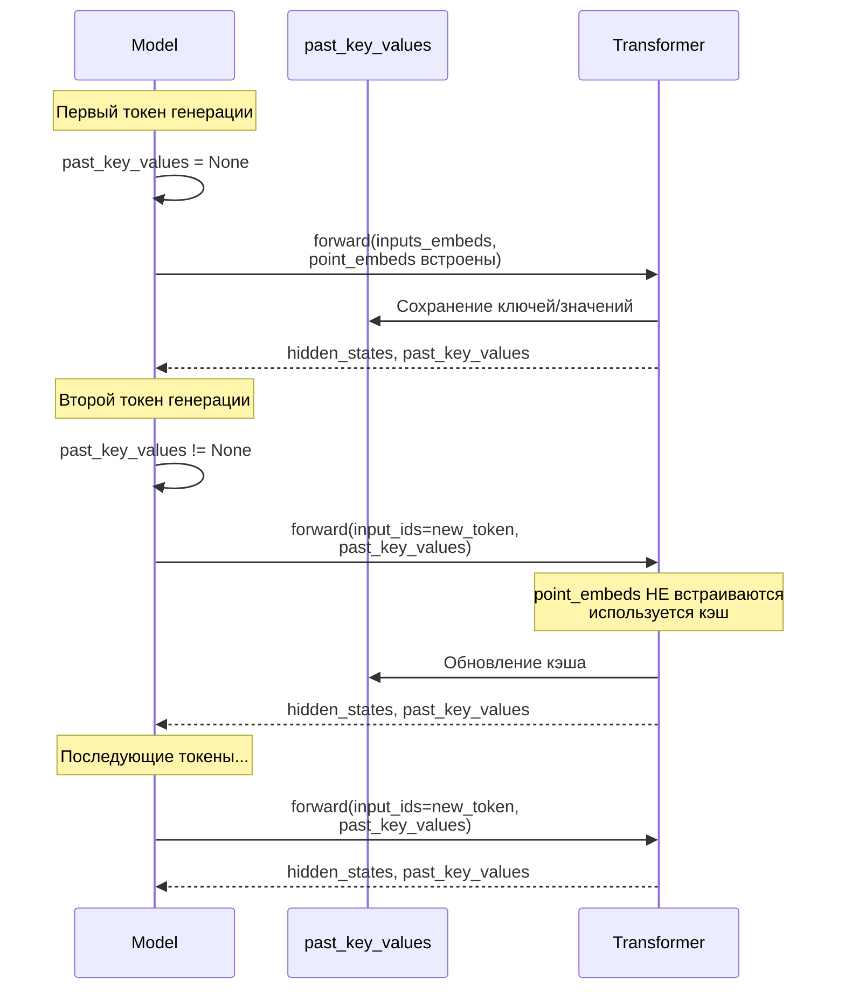

# Диаграммы последовательности операций генерации CAD-кода

## Оглавление

1. [Последовательность операций в CAD-Recode](#последовательность-операций-в-cad-recode)
2. [Последовательность операций в Cadrille](#последовательность-операций-в-cadrille)
3. [Сравнение процессов генерации](#сравнение-процессов-генерации)

---

## Последовательность операций в CAD-Recode

### Полный цикл генерации



### Детальный forward pass CAD-Recode



---

## Последовательность операций в Cadrille

### Полный цикл генерации



### Детальный forward pass Cadrille

```mermaid
flowchart TD
    Start([Начало forward]) --> CheckInputs{inputs_embeds<br/>заданы?}
    
    CheckInputs -->|Нет| CreateTextEmbeds[Создание текстовых embeddings<br/>embed_tokens input_ids]
    CheckInputs -->|Да| CheckVisual{Есть визуальные<br/>входы?}
    
    CreateTextEmbeds --> CheckVisual
    
    CheckVisual -->|Есть pixel_values| ProcessImages[Обработка изображений<br/>visual encoder]
    CheckVisual -->|Есть pixel_values_videos| ProcessVideos[Обработка видео<br/>visual encoder]
    CheckVisual -->|Есть is_pc| CheckCache{past_key_values<br/>is None?}
    
    ProcessImages --> ValidateImages[Проверка соответствия<br/>image_token_id и features]
    ValidateImages --> EmbedImages[masked_scatter<br/>image_embeds]
    
    ProcessVideos --> ValidateVideos[Проверка соответствия<br/>video_token_id и features]
    ValidateVideos --> EmbedVideos[masked_scatter<br/>video_embeds]
    
    EmbedImages --> CheckCache
    EmbedVideos --> CheckCache
    
    CheckCache -->|Да| EncodePC[Кодирование point cloud<br/>FourierPointEncoder]
    CheckCache -->|Нет| CalcRoPE[Вычисление RoPE<br/>с учетом визуальных токенов]
    
    EncodePC --> FourierStep[Fourier encoding через<br/>FourierEmbedder:<br/>1. Умножение на частоты<br/>2. sin/cos преобразование<br/>3. Объединение]
    
    FourierStep --> Project[Проекция в hidden_size<br/>nn.Linear 51 -> hidden_size]
    
    Project --> CalcStartIdxs[Вычисление start_idxs<br/>attention_mask.shape[1] -<br/>attention_mask.sum axis=1]
    
    CalcStartIdxs --> EmbedPC[Встраивание через цикл<br/>inputs_embeds[i, start_idx:...]<br/>= point_embeds[i]]
    
    EmbedPC --> CalcRoPE
    
    CalcRoPE --> CallBase[Вызов базовой модели<br/>Qwen2VLModel forward<br/>с position_ids]
    
    CallBase --> GetLogits[Вычисление логитов<br/>lm_head hidden_states]
    
    GetLogits --> ComputeLoss{labels<br/>заданы?}
    
    ComputeLoss -->|Да| CalcLoss[Вычисление CrossEntropyLoss]
    ComputeLoss -->|Нет| NoLoss[loss = None]
    
    CalcLoss --> Return[Возврат Qwen2VLCausalLMOutputWithPast]
    NoLoss --> Return
    
    Return --> End([Конец])
```

---

## Сравнение процессов генерации

### Подготовка входных данных



### Интеграция point embeddings

```mermaid
flowchart TD
    subgraph CADRecodeMethod[CAD-Recode метод]
        C1[inputs_embeds = embed_tokens input_ids] --> C2[point_embeds = FourierPointEncoder]
        C2 --> C3[Векторная операция:<br/>inputs_embeds[attention_mask == -1]<br/>= point_embeds.reshape]
        C3 --> C4[attention_mask[-1] = 1]
        C4 --> C5[input_ids = None]
    end
    
    subgraph CadrilleMethod[Cadrille метод]
        D1[inputs_embeds = embed_tokens input_ids] --> D2[Обработка изображений/видео<br/>если есть]
        D2 --> D3[point_embeds = FourierPointEncoder]
        D3 --> D4[Вычисление start_idxs:<br/>attention_mask.shape[1] -<br/>attention_mask.sum axis=1]
        D4 --> D5[Цикл по батчу:<br/>inputs_embeds[i, start_idx:...]<br/>= point_embeds[i]]
    end
```

### Обработка кэша при генерации



---

## Ключевые различия в последовательностях

### 1. Подготовка данных

| Этап | CAD-Recode | Cadrille |
|------|------------|----------|
| Нормализация | В `run_inference_batch()` | В датасете (`CadRecodeDataset`) |
| Генерация PC | В `run_inference_batch()` | В датасете (`get_point_cloud()`) |
| Создание токенов | Прямое создание списков | Через `processor()` и `collate()` |
| Chat template | Нет | Да (`apply_chat_template()`) |
| Обработка визуальных данных | Нет | Да (`process_vision_info()`) |

### 2. Forward pass

| Этап | CAD-Recode | Cadrille |
|------|------------|----------|
| Текстовые embeddings | `embed_tokens(input_ids)` | `embed_tokens(input_ids)` |
| Визуальные embeddings | Нет | `visual(pixel_values/videos)` |
| Point embeddings | `FourierPointEncoder` | `FourierPointEncoder` |
| Интеграция PC | Векторная операция `[mask == -1]` | Цикл по батчу с `start_idxs` |
| RoPE | Стандартная | С учетом визуальных токенов |
| Базовый трансформер | `Qwen2Model` | `Qwen2VLModel` |

### 3. Декодирование

| Этап | CAD-Recode | Cadrille |
|------|------------|----------|
| Метод | `extract_code()` (ручная очистка) | `processor.batch_decode()` |
| Удаление токенов | Ручное удаление `<|im_start|>`, `<|endoftext|>` | Автоматическое через `skip_special_tokens=True` |
| Обработка батча | По одному элементу | Векторизованная обработка |

---

## Оптимизации генерации

### Использование кэша (past_key_values)

**Обе модели:**

1. **Первый проход (prefill):**
   - Point embeddings встраиваются в последовательность
   - Все входные токены обрабатываются
   - Ключи и значения сохраняются в `past_key_values`

2. **Последующие проходы (decode):**
   - Point embeddings **не** встраиваются повторно
   - Обрабатывается только новый токен
   - Используются сохраненные ключи/значения из кэша
   - Это значительно ускоряет генерацию

### Различия в оптимизациях

**CAD-Recode:**
- Простая структура кэша
- Только текстовые токены в кэше
- Минимальные вычисления на каждом шаге

**Cadrille:**
- Более сложная структура кэша
- Визуальные токены также кэшируются
- RoPE вычисляется с учетом визуальных токенов
- Больше вычислений на первом проходе, но эффективная генерация
