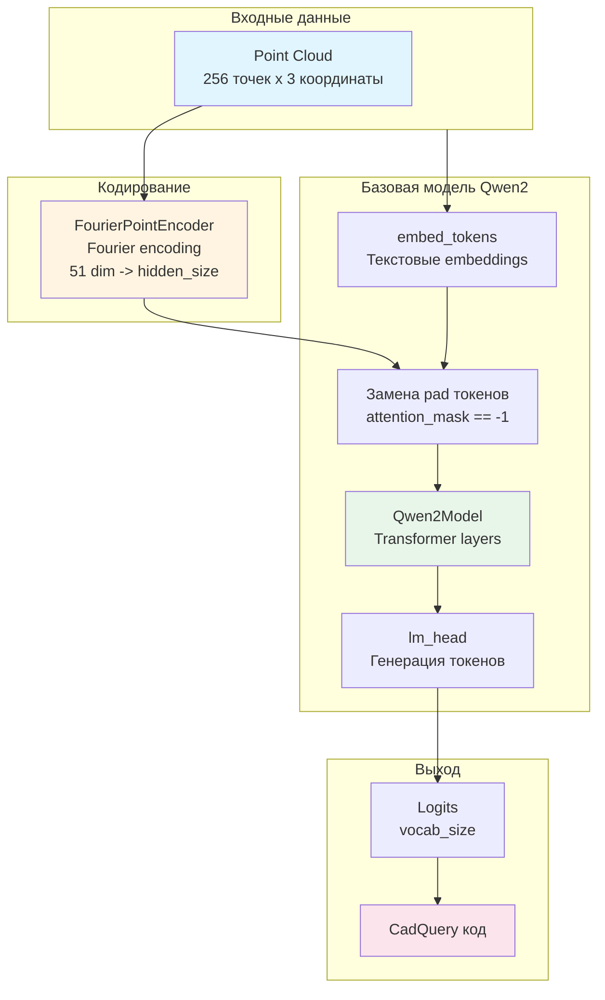
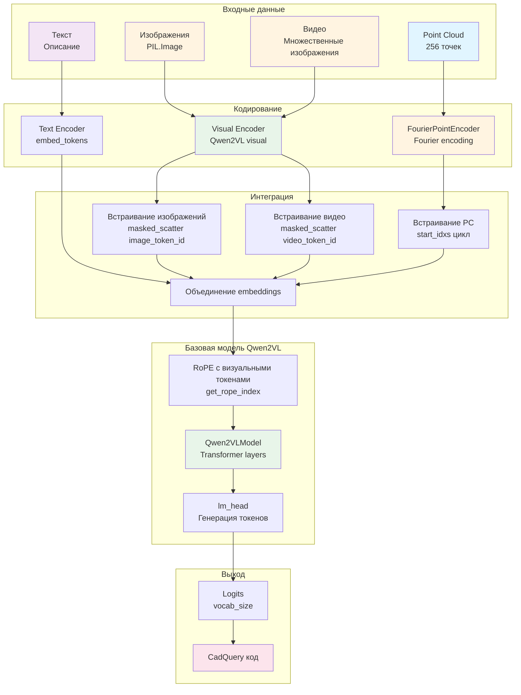
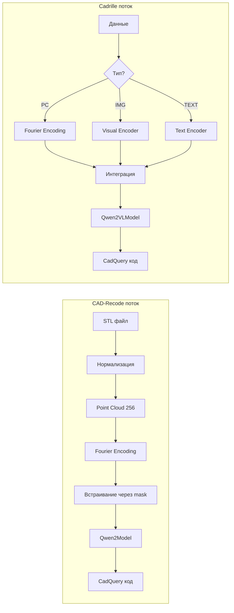
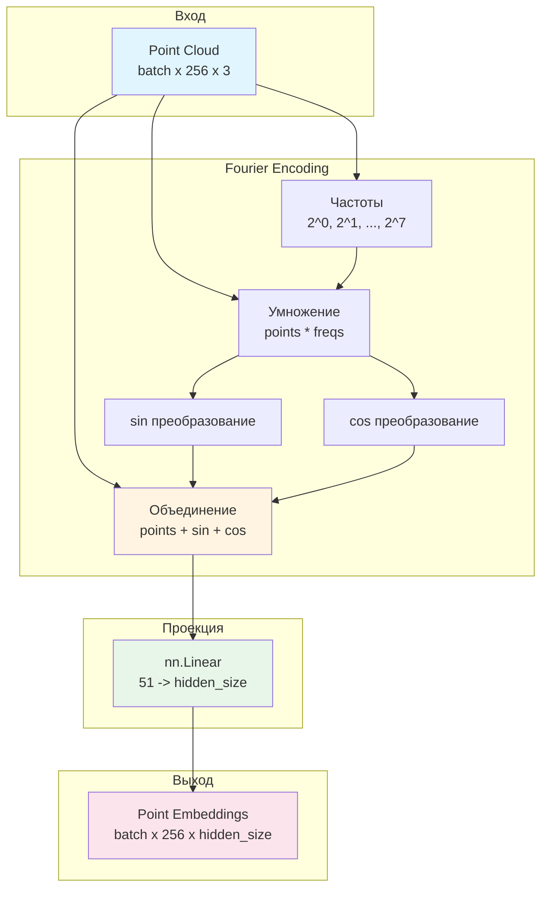
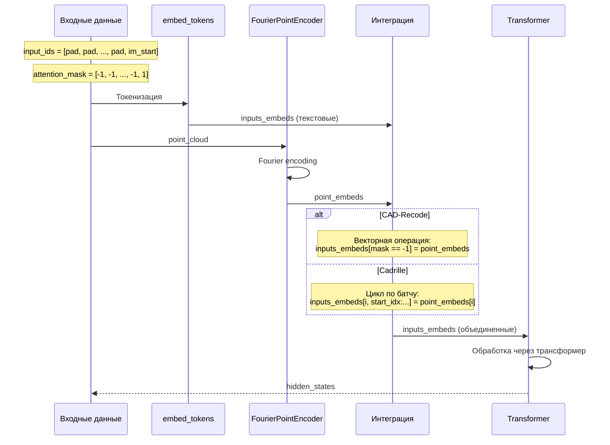
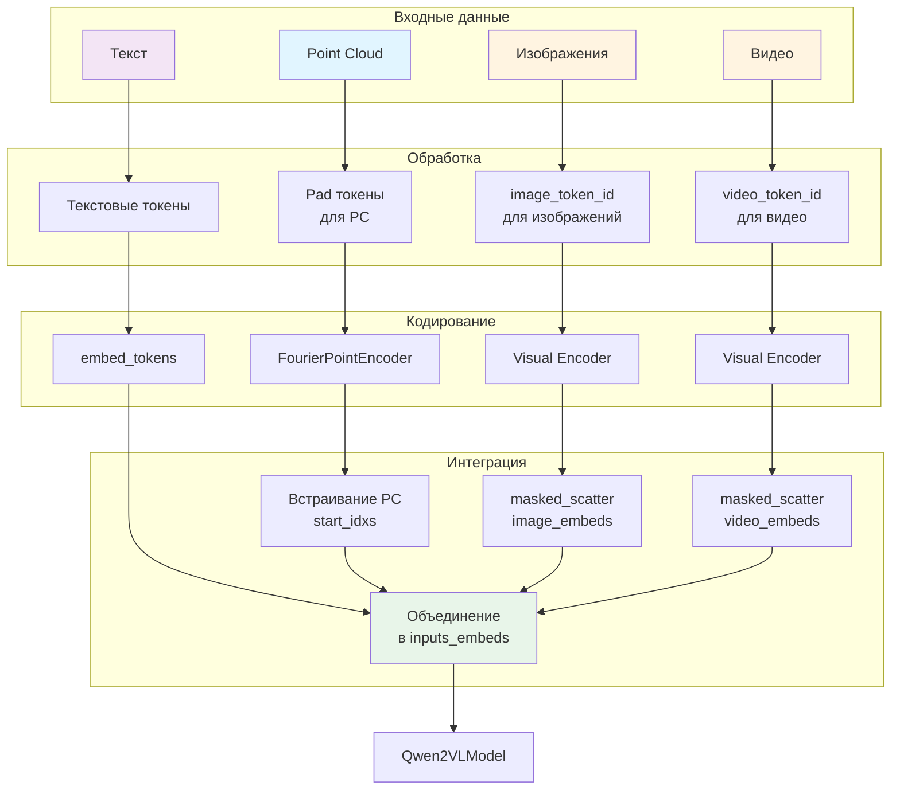

# Архитектурные диаграммы моделей CAD-Recode и Cadrille

## Архитектура CAD-Recode

## Архитектура Cadrille

## Сравнение потоков данных

## Детальная архитектура Fourier Point Encoding

## Интеграция point embeddings в последовательность

## Обработка мультимодальных входов в Cadrille

