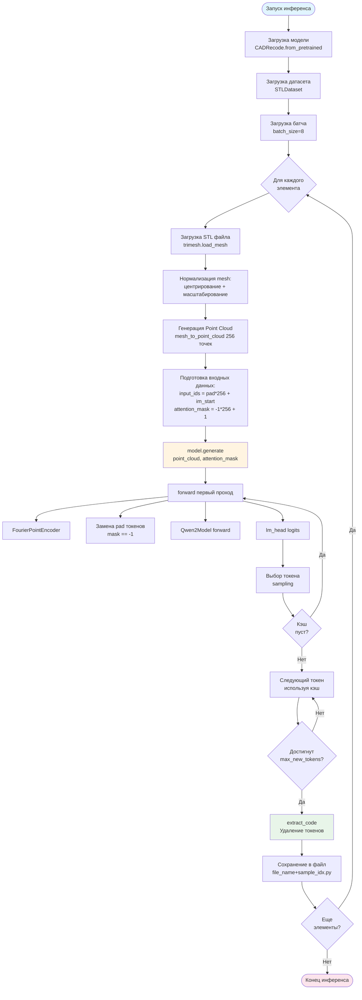
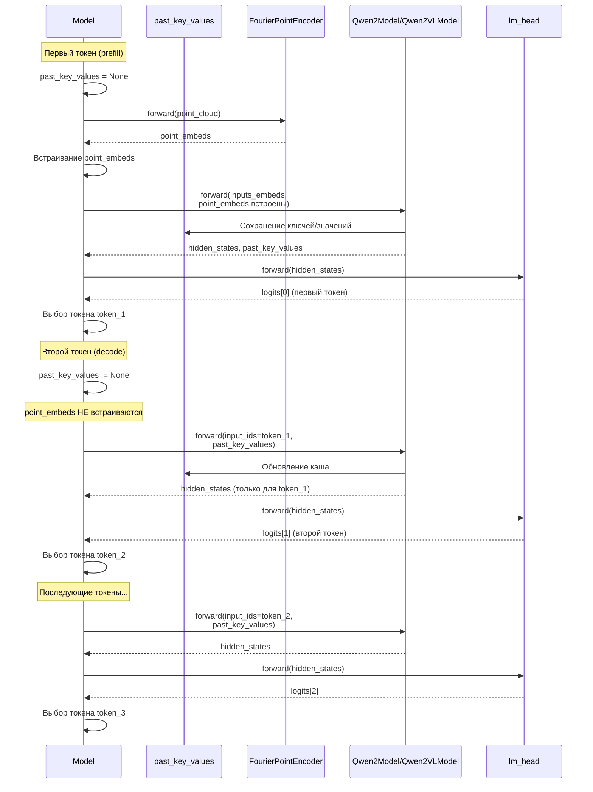
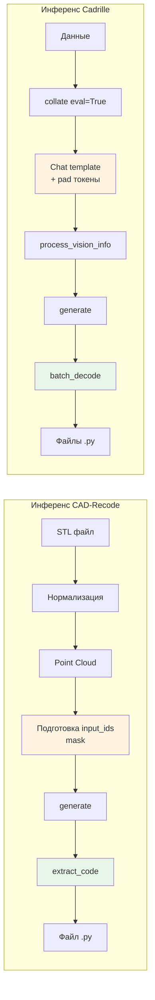

# Диаграммы процессов инференса

## Полный цикл инференса CAD-Recode

```mermaid
flowchart TD
    Start([Запуск инференса]) --> LoadModel[Загрузка модели<br/>CADRecode.from_pretrained]
    
    LoadModel --> LoadDataset[Загрузка датасета<br/>STLDataset]
    
    LoadDataset --> LoadBatch[Загрузка батча<br/>batch_size=8]
    
    LoadBatch --> ForEach{Для каждого<br/>элемента}
    
    ForEach --> LoadSTL[Загрузка STL файла<br/>trimesh.load_mesh]
    
    LoadSTL --> Normalize[Нормализация mesh:<br/>центрирование + масштабирование]
    
    Normalize --> GenPC[Генерация Point Cloud<br/>mesh_to_point_cloud 256 точек]
    
    GenPC --> PrepareInput[Подготовка входных данных:<br/>input_ids = pad*256 + im_start<br/>attention_mask = -1*256 + 1]
    
    PrepareInput --> Generate[model.generate<br/>point_cloud, attention_mask]
    
    Generate --> Forward[forward первый проход]
    
    Forward --> EncodePC[FourierPointEncoder]
    Forward --> Replace[Замена pad токенов<br/>mask == -1]
    Forward --> Transform[Qwen2Model forward]
    Forward --> Logits[lm_head logits]
    
    Logits --> Sample[Выбор токена<br/>sampling]
    
    Sample --> Cache{Кэш<br/>пуст?}
    
    Cache -->|Нет| NextToken[Следующий токен<br/>используя кэш]
    Cache -->|Да| Forward
    
    NextToken --> CheckEnd{Достигнут<br/>max_new_tokens?}
    
    CheckEnd -->|Нет| NextToken
    CheckEnd -->|Да| Decode[extract_code<br/>Удаление токенов]
    
    Decode --> Save[Сохранение в файл<br/>file_name+sample_idx.py]
    
    Save --> MoreElements{Еще<br/>элементы?}
    
    MoreElements -->|Да| ForEach
    MoreElements -->|Нет| End([Конец инференса])
    
    style Start fill:#e1f5ff
    style Generate fill:#fff4e1
    style Decode fill:#e8f5e9
    style End fill:#fce4ec
```

## Полный цикл инференса Cadrille

```mermaid
flowchart TD
    Start([Запуск инференса]) --> LoadModel[Загрузка модели<br/>Cadrille.from_pretrained]
    
    LoadModel --> LoadDataset[Загрузка датасета<br/>CadRecodeDataset/Text2CADDataset]
    
    LoadDataset --> LoadBatch[Загрузка батча<br/>batch_size зависит от mode]
    
    LoadBatch --> Collate[collate batch, processor,<br/>n_points=256, eval=True]
    
    Collate --> CreateMessages[Формирование сообщений<br/>только user без assistant]
    
    CreateMessages --> ChatTemplate[Применение chat template<br/>add_generation_prompt=True]
    
    ChatTemplate --> AddPads{Есть PC?}
    
    AddPads -->|Да| AddPadTokens[Добавление pad токенов]
    AddPads -->|Нет| ProcessVision{Есть<br/>изображения?}
    
    AddPadTokens --> ProcessVision
    
    ProcessVision -->|Да| ProcessImg[process_vision_info<br/>для изображений/видео]
    ProcessVision -->|Нет| Tokenize[Токенизация]
    
    ProcessImg --> Tokenize
    
    Tokenize --> Generate[model.generate<br/>с полным набором параметров]
    
    Generate --> Forward[forward первый проход]
    
    Forward --> EncodeText[embed_tokens<br/>текстовые embeddings]
    
    Forward --> EncodeImg{Есть<br/>изображения?}
    EncodeImg -->|Да| VisualImg[Visual encoder<br/>изображения]
    EncodeImg -->|Нет| EncodeVid{Есть<br/>видео?}
    
    VisualImg --> EmbedImg[masked_scatter<br/>image_token_id]
    
    EncodeVid -->|Да| VisualVid[Visual encoder<br/>видео]
    EncodeVid -->|Нет| EncodePC{Есть<br/>PC?}
    
    VisualVid --> EmbedVid[masked_scatter<br/>video_token_id]
    
    EncodePC -->|Да| FourierPC[FourierPointEncoder]
    EncodePC -->|Нет| RoPE
    
    FourierPC --> EmbedPC[Встраивание через<br/>start_idxs цикл]
    
    EmbedImg --> RoPE
    EmbedVid --> RoPE
    EmbedPC --> RoPE
    
    RoPE[Вычисление RoPE<br/>с учетом визуальных токенов]
    
    RoPE --> Transform[Qwen2VLModel forward]
    
    Transform --> Logits[lm_head logits]
    
    Logits --> Sample[Выбор токена]
    
    Sample --> Cache{Кэш<br/>пуст?}
    
    Cache -->|Нет| NextToken[Следующий токен<br/>используя кэш]
    Cache -->|Да| Forward
    
    NextToken --> CheckEnd{Достигнут<br/>max_new_tokens?}
    
    CheckEnd -->|Нет| NextToken
    CheckEnd -->|Да| Decode[processor.batch_decode<br/>skip_special_tokens=True]
    
    Decode --> Save[Сохранение в файлы]
    
    Save --> MoreBatches{Еще<br/>батчи?}
    
    MoreBatches -->|Да| LoadBatch
    MoreBatches -->|Нет| End([Конец инференса])
    
    style Start fill:#e1f5ff
    style Generate fill:#fff4e1
    style Decode fill:#e8f5e9
    style End fill:#fce4ec
```

## Генерация токенов с кэшированием

```mermaid
sequenceDiagram
    participant Model
    participant Cache as past_key_values
    participant PCEnc as FourierPointEncoder
    participant Transformer as Qwen2Model/Qwen2VLModel
    participant LMHead as lm_head
    
    Note over Model: Первый токен (prefill)
    Model->>Model: past_key_values = None
    Model->>PCEnc: forward(point_cloud)
    PCEnc-->>Model: point_embeds
    Model->>Model: Встраивание point_embeds
    Model->>Transformer: forward(inputs_embeds,<br/>point_embeds встроены)
    Transformer->>Cache: Сохранение ключей/значений
    Transformer-->>Model: hidden_states, past_key_values
    Model->>LMHead: forward(hidden_states)
    LMHead-->>Model: logits[0] (первый токен)
    Model->>Model: Выбор токена token_1
    
    Note over Model: Второй токен (decode)
    Model->>Model: past_key_values != None
    Note over Model: point_embeds НЕ встраиваются
    Model->>Transformer: forward(input_ids=token_1,<br/>past_key_values)
    Transformer->>Cache: Обновление кэша
    Transformer-->>Model: hidden_states (только для token_1)
    Model->>LMHead: forward(hidden_states)
    LMHead-->>Model: logits[1] (второй токен)
    Model->>Model: Выбор токена token_2
    
    Note over Model: Последующие токены...
    Model->>Transformer: forward(input_ids=token_2,<br/>past_key_values)
    Transformer-->>Model: hidden_states
    Model->>LMHead: forward(hidden_states)
    LMHead-->>Model: logits[2]
    Model->>Model: Выбор токена token_3
```

## Сравнение процессов инференса

```mermaid
graph LR
    subgraph CADRecodeInf[Инференс CAD-Recode]
        R1[STL файл] --> R2[Нормализация]
        R2 --> R3[Point Cloud]
        R3 --> R4[Подготовка input_ids<br/>mask]
        R4 --> R5[generate]
        R5 --> R6[extract_code]
        R6 --> R7[Файл .py]
    end
    
    subgraph CadrilleInf[Инференс Cadrille]
        C1[Данные] --> C2[collate eval=True]
        C2 --> C3[Chat template<br/>+ pad токены]
        C3 --> C4[process_vision_info]
        C4 --> C5[generate]
        C5 --> C6[batch_decode]
        C6 --> C7[Файлы .py]
    end
    
    style R4 fill:#fff4e1
    style R6 fill:#e8f5e9
    style C3 fill:#fff4e1
    style C6 fill:#e8f5e9
```
