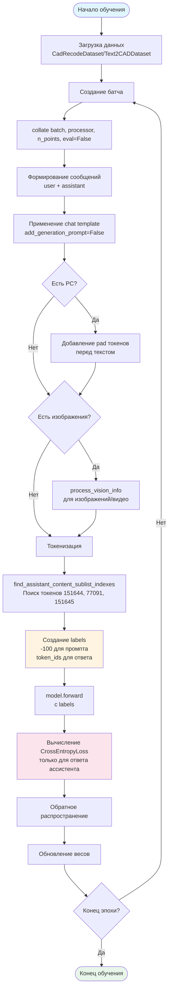
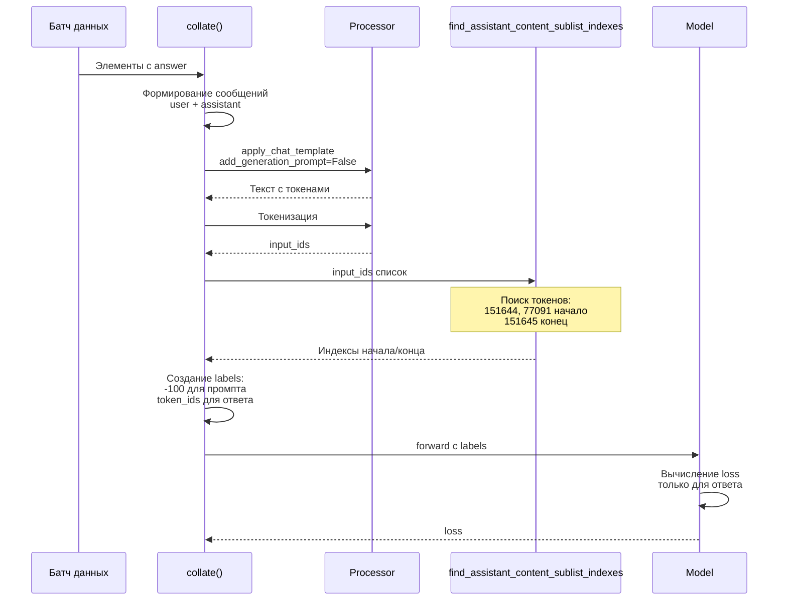
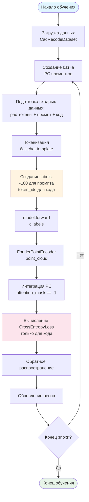

# Диаграммы процессов обучения

## Процесс обучения Cadrille

```mermaid
flowchart TD
    Start([Начало обучения]) --> LoadData[Загрузка данных<br/>CadRecodeDataset/Text2CADDataset]
    
    LoadData --> Batch[Создание батча]
    
    Batch --> Collate[collate batch, processor, n_points, eval=False]
    
    Collate --> CreateMessages[Формирование сообщений<br/>user + assistant]
    
    CreateMessages --> ChatTemplate[Применение chat template<br/>add_generation_prompt=False]
    
    ChatTemplate --> AddPads{Есть PC?}
    AddPads -->|Да| AddPadTokens[Добавление pad токенов<br/>перед текстом]
    AddPads -->|Нет| ProcessVision{Есть изображения?}
    
    AddPadTokens --> ProcessVision
    
    ProcessVision -->|Да| ProcessImg[process_vision_info<br/>для изображений/видео]
    ProcessVision -->|Нет| Tokenize[Токенизация]
    
    ProcessImg --> Tokenize
    
    Tokenize --> FindLabels[find_assistant_content_sublist_indexes<br/>Поиск токенов 151644, 77091, 151645]
    
    FindLabels --> CreateLabels[Создание labels<br/>-100 для промпта<br/>token_ids для ответа]
    
    CreateLabels --> Forward[model.forward<br/>с labels]
    
    Forward --> ComputeLoss[Вычисление CrossEntropyLoss<br/>только для ответа ассистента]
    
    ComputeLoss --> Backward[Обратное распространение]
    
    Backward --> Update[Обновление весов]
    
    Update --> CheckEnd{Конец эпохи?}
    
    CheckEnd -->|Нет| Batch
    CheckEnd -->|Да| End([Конец обучения])
    
    style Start fill:#e1f5ff
    style CreateLabels fill:#fff4e1
    style ComputeLoss fill:#fce4ec
    style End fill:#e8f5e9
```

## Формирование labels в Cadrille

```mermaid
sequenceDiagram
    participant Batch as Батч данных
    participant Collate as collate()
    participant Processor as Processor
    participant FindLabels as find_assistant_content_sublist_indexes
    participant Model as Model
    
    Batch->>Collate: Элементы с answer
    Collate->>Collate: Формирование сообщений<br/>user + assistant
    Collate->>Processor: apply_chat_template<br/>add_generation_prompt=False
    Processor-->>Collate: Текст с токенами
    
    Collate->>Processor: Токенизация
    Processor-->>Collate: input_ids
    
    Collate->>FindLabels: input_ids список
    Note over FindLabels: Поиск токенов:<br/>151644, 77091 начало<br/>151645 конец
    FindLabels-->>Collate: Индексы начала/конца
    
    Collate->>Collate: Создание labels:<br/>-100 для промпта<br/>token_ids для ответа
    
    Collate->>Model: forward с labels
    Model->>Model: Вычисление loss<br/>только для ответа
    Model-->>Collate: loss
```

## Процесс обучения CAD-Recode

```mermaid
flowchart TD
    Start([Начало обучения]) --> LoadData[Загрузка данных<br/>CadRecodeDataset]
    
    LoadData --> Batch[Создание батча<br/>PC элементов]
    
    Batch --> PrepareInput[Подготовка входных данных:<br/>pad токены + промпт + код]
    
    PrepareInput --> Tokenize[Токенизация<br/>без chat template]
    
    Tokenize --> CreateLabels[Создание labels:<br/>-100 для промпта<br/>token_ids для кода]
    
    CreateLabels --> Forward[model.forward<br/>с labels]
    
    Forward --> EncodePC[FourierPointEncoder<br/>point_cloud]
    
    EncodePC --> Integrate[Интеграция PC<br/>attention_mask == -1]
    
    Integrate --> ComputeLoss[Вычисление CrossEntropyLoss<br/>только для кода]
    
    ComputeLoss --> Backward[Обратное распространение]
    
    Backward --> Update[Обновление весов]
    
    Update --> CheckEnd{Конец эпохи?}
    
    CheckEnd -->|Нет| Batch
    CheckEnd -->|Да| End([Конец обучения])
    
    style Start fill:#e1f5ff
    style CreateLabels fill:#fff4e1
    style ComputeLoss fill:#fce4ec
    style End fill:#e8f5e9
```

## Сравнение процессов обучения

```mermaid
graph TB
    subgraph CadrilleTrain[Обучение Cadrille]
        C1[Данные: PC/IMG/TEXT] --> C2[collate с chat template]
        C2 --> C3[Токенизация через processor]
        C3 --> C4[find_assistant_content_sublist_indexes]
        C4 --> C5[Labels только для ответа]
        C5 --> C6[Forward с мультимодальными входами]
        C6 --> C7[Loss вычисляется]
    end
    
    subgraph CADRecodeTrain[Обучение CAD-Recode]
        R1[Данные: только PC] --> R2[Прямая подготовка]
        R2 --> R3[Токенизация без template]
        R3 --> R4[Прямое формирование labels]
        R4 --> R5[Forward только с PC]
        R5 --> R6[Loss вычисляется]
    end
    
    style C2 fill:#fff4e1
    style C4 fill:#e8f5e9
    style R2 fill:#fff4e1
    style R4 fill:#e8f5e9
```
